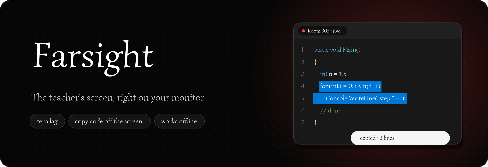

<p align="center">
  
</p>

<p align="center">
  Сидишь на последней парте, а код на доске или старом телевизоре не разглядеть?<br>
  <b>Farsight</b> показывает экран преподавателя на компьютере студента в реальном времени,<br>
  а код можно выделить мышкой и скопировать — как в обычном редакторе.
</p>

<p align="center">
  <a href="https://github.com/WhIteGh0s1/Farsight/releases/latest/download/Farsight-Setup.exe"></a>
  <br>
  <sub>Windows 10/11 · 64-бит · бесплатно · без интернета</sub>
</p>
---

## Что умеет

- **Трансляция без задержки.** Только изменившиеся куски экрана, без потерь качества: код всегда чёткий. На обычном Wi-Fi задержка 15–150 мс. Прокрутка кода передаётся отдельной командой и почти не нагружает сеть.
- **Копирование кода с картинки.** Выделяешь мышкой, жмёшь `Ctrl+C`. Выделение прилипает к буквам, номера строк не захватываются. Farsight сам узнаёт шрифт редактора и читает каждую букву, поэтому `l` / `1` / `I`, `0` / `O`, `;` / `:` и отступы получаются точными.
- **Обычный текст тоже.** Слайды, документы, любые окна по-русски и по-английски читает встроенная нейросеть (PaddleOCR). Работает без интернета, около 0,1 с.
- **Код от препода в один клик.** Препод нажал `Ctrl+C` в редакторе, у студентов появилась кнопка «Препод скопировал код».
- **Отправить свой код преподу.** Он получит его с твоим именем, копии сохраняются в `Документы\Farsight`.
- **Пауза для препода.** `Ctrl+Alt+P`, чтобы открыть журнал или ввести пароль: студенты увидят заглушку.
- **Окно любого размера** без чёрных полос, полноэкранный режим по `F`.
- **Обновляется сам.** Новая версия скачивается в фоне, проверяется по контрольной сумме и ставится, когда Farsight никто не использует. Выключается в меню трея.

## Быстрый старт

1. Скачай [**Farsight-Setup.exe**](../../releases/latest/download/Farsight-Setup.exe) и запусти. Windows может предупредить о неизвестном издателе: «Подробнее» → «Выполнить в любом случае».
   Farsight установится в `C:\ProgramData\Farsight`: Windows **один раз** спросит права админа, дальше — никаких «Разрешить», автозапуск для всех пользователей компа, настройки сохраняются.
2. Выбери роль:
   - **Комп препода**: Farsight сидит в трее и транслирует экран;
   - **Я студент**: Farsight сам находит препода в локальной сети.
3. Всё, дальше он запускается вместе с Windows и сам обновляется.

Попробовать на одном компьютере: `Farsight.exe --demo`.

## Установка на всю аудиторию (админу, один раз на комп)

```
Farsight.exe --install teacher --name "Ауд. 305"
Farsight.exe --install student
Farsight.exe --uninstall
```

`--install teacher` также открывает Farsight в брандмауэре. Студентам брандмауэр настраивать не нужно.

## Требования

- Windows 10 или 11, 64-бит (на 32-битной работает всё, кроме нейросети).
- Локальная сеть между компами: UDP 47810 (поиск), TCP 47811 (картинка). Интернет не нужен.
- Если аудитории в разных подсетях: «подключиться по IP вручную» в меню студента.

## Приватность

- Студенты ничего не могут сделать на компьютере препода: только смотреть и просить текст.
- Текст напрямую читается только из окон редакторов кода (VS, VS Code, PascalABC.NET, PyCharm, Блокнот…), никогда из браузера или почты.
- Всё работает внутри локальной сети, ничего не уходит в интернет.

---

Исходный код закрыт. Сторонние компоненты и их лицензии перечислены в `THIRD_PARTY_NOTICES.txt` рядом с программой.
